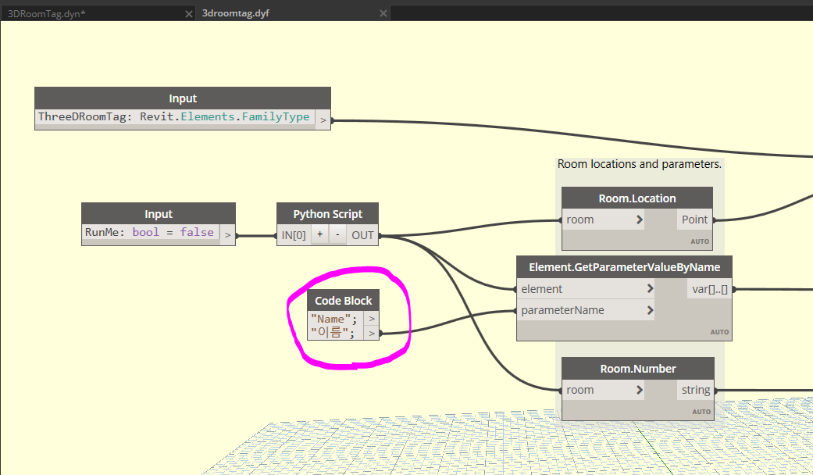

### 출처

https://github.com/johnpierson/RhythmForDynamo
Rhythm.3DRoomTag 를 한국어에서 작동하도록 "Name" 을 "이름"으로 수정함

### 샘플 실행 과정

1. 3DRoomTag.rvt 파일을 열고,
2. 레빗 관리 메뉴에서 오른쪽 맨끝에 Dynamo 실행,
3. 열기 실행하고 3DRoomTag.dyn을 실행
4. Dyanmo 화면 좌측하단에 실행을 누르고,
5. 3D 뷰에서 3DRoomTag가 작성된 것을 확인

### 활용 준비 사항

다른 파일에서는 패밀리 3dRoomTag.rfa를 로드하고 실행해야 함.
